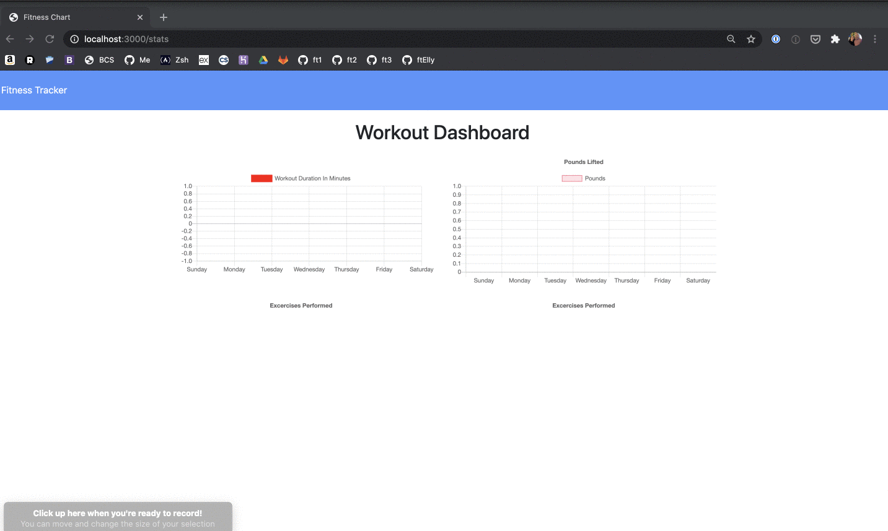

# Workout Has noSQL
This app tracks workouts so users can keep tabs on their fitness progress. It uses Node, Express, MongoDB and Mongoose. 
## Table of Contents
1. [Description](#description)
2. [Installation](#installation)
3. [Contributing](#contributing)
4. [License](#license)



## Description
Logging workouts allows users to track their progress over time. In this application, users can log both resistance and cardio workouts. 
Users can record the name, type, weight, sets, reps, and duration of strength exercises. They can also track the distance covered of cardio exercises. 

The application can be started with this command:

```sh
node server.js
```

The user will be told what port the app is running on and can go to `localhost:` in the web browser.

<!-- The application is also located on Heroku at this link: -->


## Installation

Run `npm install` to include all necessary dependencies. To include seed data that is provided, run `npm run seed`. 

## Contributing

Contributions and improvements to the project are welcome at any time. 

### License
[](https://opensource.org/licenses/MIT)